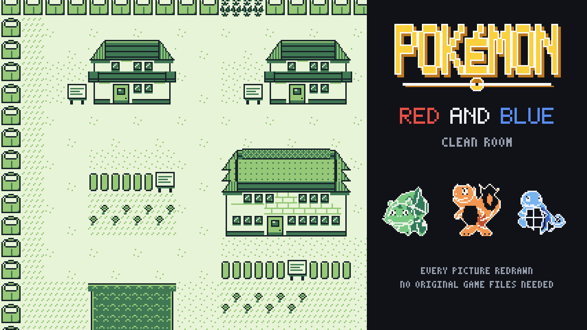

# Pokemon Red and Blue — clean room

**Play:** https://andrewnakas.github.io/pokered-cleanroom/ (Red; the Blue button under the game switches version)



A browser build of Pokemon Red and Blue in which **every picture is regenerated**. The program, maps, text and
music sequences come from the [pret/pokered](https://github.com/pret/pokered) disassembly; all 509 pictures the
two games use (151 creatures front and back, 45 trainers, 67 overworld sprites, 19 tilesets, font, HUD, title,
town map, battle effects ...) are drawn by the code and briefs in this repository. The ROMs are assembled with
rgbds from a tree that holds no retail picture and run in the page on EmulatorJS (gambatte core).
No original game file is needed or shipped.

## How it works

```
pret/pokered clone (dirty: holds the retail pictures)
   └─ games/pokered/extract_spec.py ──> games/pokered/spec/assets.json   coarse facts only
                                         (size, 4x4 shade grid per picture, coarse silhouette of single figures)
games/pokered/generate.py + art/*.py + briefs/*.json ──> every PNG, in a tree with all retail PNGs deleted
   └─ rgbds build ──> pokered.gbc, pokeblue.gbc (clean)
cleanroom/gb/taint.py: clean pictures vs every retail tile and stream ──> must print "FAILING: 0"
ports/ejs/make_site.py ──> site (EmulatorJS + gambatte + clean ROMs)
```

- **Tile sheets, font, HUD, UI** keep no shape information at all: each tile is redrawn from what it is
  (`art/ts_*.py`, `art/font.py`, `art/misc.py`).
- **Creatures and trainers**: a deliberately coarse silhouette plus a brief written by us (`briefs/*.json`:
  cut/add shapes, eyes, lines, regions), rendered by `art/pics.py`.
- **Sprites**: the 1-bit transparency of each 16x16 frame plus drawn bands, faces and details (`art/sprites.py`).
- **Kept as they are** (code/data, not pictures): maps, blocksets, tilemaps, text, palettes, and the music,
  sound effect and cry command sequences.

Details, traps and the taint rule: [docs/PLATFORM_GAME_BOY.md](docs/PLATFORM_GAME_BOY.md),
[docs/DECOMP_PLAYBOOK.md](docs/DECOMP_PLAYBOOK.md), [STATUS.md](STATUS.md).

## Build it yourself

```
git clone -c core.autocrlf=false -c core.eol=lf --depth 1 https://github.com/pret/pokered D:/n64work/pokered/pristine
# rgbds 1.0.4 in D:/n64work/pokered/rgbds, make + a C compiler on PATH
sh games/pokered/build_clean.sh fresh          # generate all pictures, build Red and Blue
python -m games.pokered.play D:/n64work/pokered/clean/pokered.gbc shots.png --shots 300,900   # headless check (PyBoy)
```

The taint scan and `extract_spec.py` need a built pret tree; nothing else does.

## Credits and licences

- Game program and data layout: documented by the pret/pokered contributors.
- Runtime in the web page: EmulatorJS (GPL-3.0) and the libretro gambatte core (GPL-2.0); see `THIRD_PARTY.md` in the site.
- Pictures, drawing code and briefs in this repository: made for this project.

Pokemon is a trademark of its owners; this is an unofficial fan project and is not affiliated with them.
